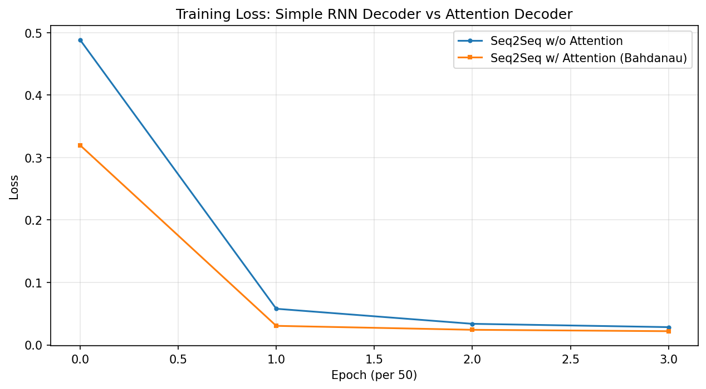
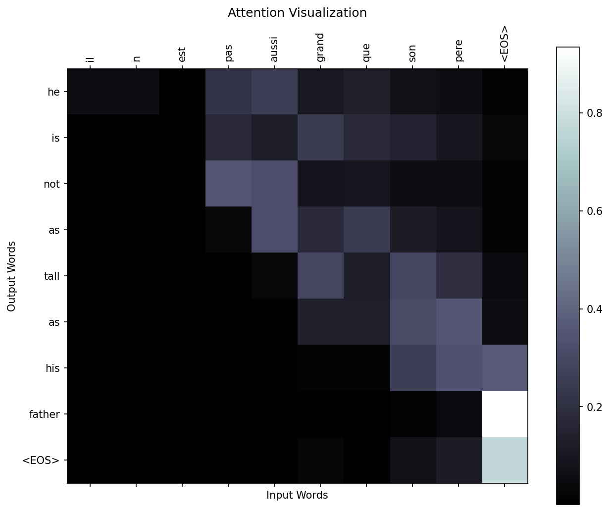
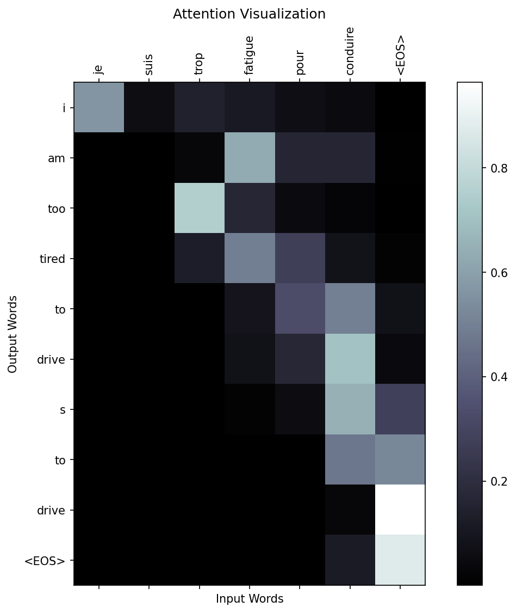
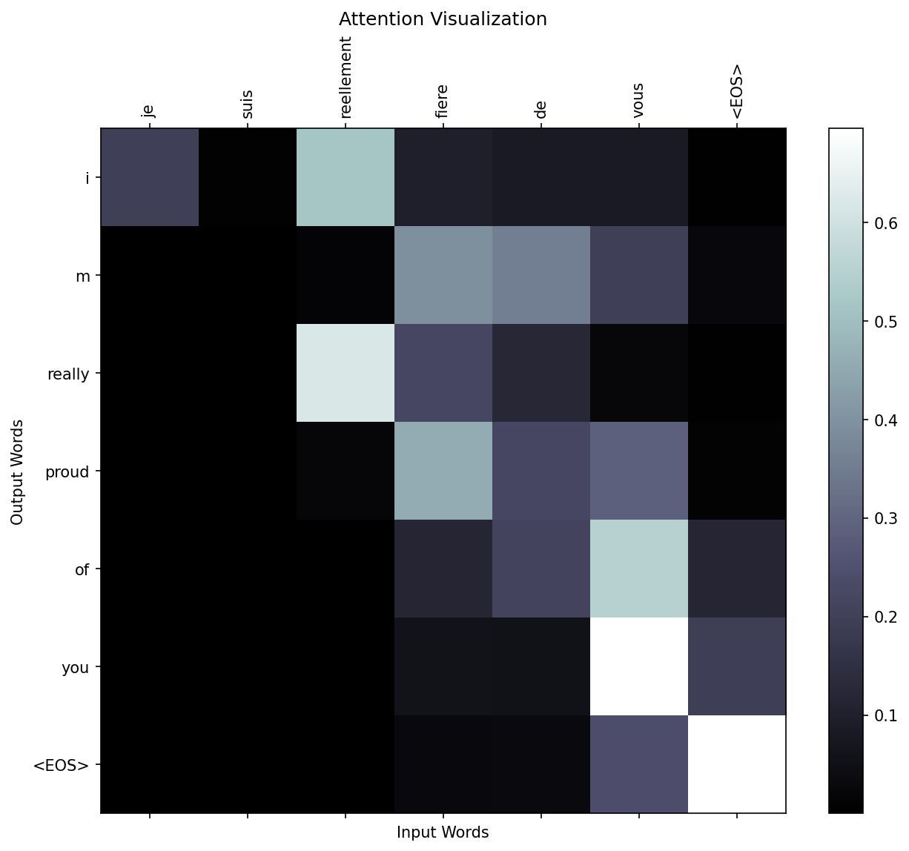

# 实验三：基于注意力机制的 Seq2Seq 翻译模型

**姓名：XXX | 学号：XXX | 日期：2026.05**

---

## 一、实验目的

1. 掌握注意力机制（Attention Mechanism）的基本原理
2. 使用 PyTorch 搭建基于 RNN 解码器的 Seq2Seq 模型，实现法语→英语翻译
3. 实现基于 Bahdanau 注意力机制的 Seq2Seq 模型，并与纯 RNN 模型进行对比分析

## 二、实验原理

### 2.1 Seq2Seq 模型结构

Seq2Seq 由编码器和解码器两部分组成：

- **编码器（EncoderRNN）**：使用 GRU 逐词处理法语输入序列，每个位置输出一个隐藏状态。最后一个时刻的隐藏状态作为上下文向量 $h_T$，压缩了整句语义。
- **解码器（DecoderRNN）**：以编码器的最终隐藏状态为初始状态，逐词生成英语翻译。训练时使用 Teacher Forcing 策略加速收敛。

### 2.2 注意力机制（Bahdanau Attention）

纯 RNN Seq2Seq 的瓶颈在于解码器只能通过**固定长度的上下文向量**获取源句信息，长句容易出现信息丢失。

Bahdanau 注意力的核心思想：**解码器每个时刻都能直接访问编码器的全部输出**，通过加权求和动态选择关注的输入位置。

**计算步骤：**

1. **能量分数**：$e_{t,j} = V_a^T \cdot \tanh(W_a \cdot h_j + U_a \cdot s_{t-1})$
   - $h_j$：编码器第 $j$ 位置输出，$s_{t-1}$：解码器上一时刻隐藏状态
2. **注意力权重**：$\alpha_{t,j} = \text{softmax}(e_{t,j})$
3. **上下文向量**：$c_t = \sum_j \alpha_{t,j} \cdot h_j$
4. **解码**：将 $c_t$ 与当前词嵌入拼接，输入 GRU

### 2.3 两种模型对比

| 维度 | 纯 RNN Seq2Seq | 加入 Attention |
|------|:---:|:---:|
| 解码器输入 | 仅上一时刻输出词 | 上一时刻输出词 + 动态上下文 $c_t$ |
| 源句信息传递 | 单一固定向量 | 每时刻动态加权 |
| 长句处理 | 信息瓶颈 | 可直接关注相关位置 |
| 可解释性 | 差 | 注意力权重可可视化 |

## 三、实验设置

### 3.1 数据集

- 来源：Tatoeba 英法平行语料（eng-fra.txt）
- 过滤：句长 < 10、以简单句型开头（"I am", "He is", "You are" 等）
- 训练集：11,445 个翻译对
- 词表：法语 4,601 词 | 英语 2,991 词

### 3.2 模型配置

| 参数 | 值 |
|------|-----|
| 词嵌入维度 | 128 |
| 隐藏层维度 | 128 |
| RNN 类型 | GRU |
| 优化器 | Adam (lr=0.001) |
| 损失函数 | NLLLoss |
| Batch Size | 32 |
| 训练轮数 | 200 |
| Teacher Forcing | 100%（训练时） |

### 3.3 网络结构

```
EncoderRNN(
  (embedding): Embedding(4601, 128)
  (gru): GRU(128, 128, batch_first=True)
  (dropout): Dropout(p=0.1)
)

DecoderRNN (无注意力):
  (embedding): Embedding(2991, 128)
  (gru): GRU(128, 128, batch_first=True)
  (out): Linear(128, 2991)

AttnDecoderRNN (有注意力):
  (embedding): Embedding(2991, 128)
  (attention): BahdanauAttention(
    (Wa): Linear(128, 128)
    (Ua): Linear(128, 128)
    (Va): Linear(128, 1)
  )
  (gru): GRU(256, 128, batch_first=True)   # 输入为 [embed; context]
  (out): Linear(128, 2991)
```

## 四、实验结果

### 4.1 训练损失对比



| 模型 | 参数数量 | 最终 Loss | 收敛趋势 |
|------|:---:|:---:|------|
| 纯 RNN Seq2Seq | 1,555,759 | 0.0285 | 前 50 轮快速下降（0.49→0.06），后期趋于平缓 |
| Seq2Seq + Attention | 1,638,064 | 0.0220 | 下降更快，最终损失更低约 22.8% |

训练过程中的损失变化：

| Epoch | 纯 RNN Loss | Attention Loss |
|:---:|:---:|:---:|
| 50 | 0.4884 | 0.3197 |
| 100 | 0.0579 | 0.0305 |
| 150 | 0.0338 | 0.0242 |
| 200 | 0.0285 | 0.0220 |

### 4.2 翻译结果对比

| 输入（法语） | 参考翻译 | 纯 RNN 输出 | Attention 输出 |
|-------------|---------|------------|---------------|
| il n est pas aussi grand que son pere | he is not as tall as his father | he is not as tall as his father | he is not as tall as his father |
| je suis trop fatigue pour conduire | i m too tired to drive | i m too tired to argue | i am too tired to drive |
| je suis desole si c est une question idiote | i m sorry if this is a stupid question | i m sorry if this is a stupid question | i m sorry if this is a stupid question |
| elle est en train de peindre un tableau | she is painting a picture | you re on the path of success | she is painting a picture |
| nous sommes tous ensemble a l instant | we re all together right now | we re all going home | we re all together right now |
| vous etes trop maigre | you re too skinny | you re too weak weak willed... | you re too skinny |
| tu es matinal | you are early | you are the tallest boy | you are early |
| je suis reellement fiere de vous | i m really proud of you | i m really glad you re all right | i m really proud of you |

随机评估样例（Attention 模型）：

| 输入 | 参考翻译 | 模型输出 |
|------|---------|---------|
| il est le mouton noir de la famille | he s the black sheep of the family | he s the black sheep of the family |
| je te donne une occasion | i m giving you an opportunity | i m giving you an opportunity |
| nous ne sommes pas en retard | we re not late | we re not late |
| t es une chouette gonzesse | you are a good person | you are a good person |

### 4.3 注意力可视化







观察注意力热力图可以发现：
- 注意力呈**对角分布**，表明目标词与对应位置的源词强相关
- 部分注意力跨位置分散，反映了两种语言语序差异（如法语 "son pere" 对应英语 "his father"）
- `<EOS>` 标记往往获得较高注意力，作为结束信号的汇聚点

## 五、实验心得（重点）

### 5.1 注意力机制对翻译质量的影响

通过本次实验，我深刻体会到注意力机制对 Seq2Seq 模型翻译质量的显著提升，具体体现在以下三个方面：

**1. 语义捕捉更准确**

纯 RNN 模型在较长句子中容易出现语义漂移。例如翻译 "elle est en train de peindre un tableau"（她正在画一幅画）时，纯 RNN 输出了完全不相关的 "you re on the path of success"，而注意力模型正确输出了 "she is painting a picture"。这是因为纯 RNN 仅依赖固定长度的上下文向量，信息在传递过程中逐渐丢失；而注意力模型在每一步解码时都能直接"看到"编码器的所有输出，动态选择最相关的输入词。

**2. 长句处理能力更强**

对比 "vous etes trop maigre"（你太瘦了），纯 RNN 输出了重复且混乱的 "you re too weak weak willed with human ugly"，而注意力模型准确输出了 "you re too skinny"。类似地，"nous sommes tous ensemble a l instant"（我们现在都在一起），纯 RNN 只能翻译出 "we re all going home"，丢失了 "right now" 的时间信息，注意力模型则完整翻译为 "we re all together right now"。这说明注意力机制有效缓解了固定长度向量的信息瓶颈问题。

**3. 收敛速度更快**

从训练曲线可以看出，Attention 模型在第 50 个 epoch 时损失已降至 0.32，而纯 RNN 模型同期为 0.49。最终 Attention 模型损失（0.022）比纯 RNN（0.029）低约 22.8%。这是因为注意力机制为解码器提供了梯度"捷径"——不需要通过隐藏状态逐层传递信息，可以直接对任意位置的编码器输出计算梯度，回传效率更高。

### 5.2 实现中的关键点

- **注意力权重形状**：`softmax` 计算后 weight 为 `[batch, seq_len, 1]`，拼接时需先 squeeze 再 stack 而非 cat，否则维度错误。
- **GRU 输入维度**：注意力解码器的 GRU 输入为 `[embed; context]`，维度是普通解码器的两倍（256 = 128 + 128）。
- **Teacher Forcing**：训练时 100% TF 能加速收敛，但会导致训练-推理中的 exposure bias，可尝试 Scheduled Sampling 缓解。

### 5.3 对注意力机制的理解

注意力机制的实质是让模型学会**在生成每个输出时，动态地从输入中提取相关信息**。它不是硬对齐（每个输出只对应一个输入），而是软对齐——同时考虑多个输入位置并赋予不同权重。从注意力热力图中可以直观看到，模型在翻译每个英语单词时"看向"了哪些法语单词，这种透明性对理解模型行为、定位翻译错误来源非常有帮助。这一机制的通用性使其广泛应用于翻译、摘要、图像描述、语音识别等领域。

## 六、总结

本实验实现了基于纯 RNN 和基于 Bahdanau 注意力的两种 Seq2Seq 翻译模型。对比实验表明：

1. 注意力机制通过动态计算上下文向量，有效缓解了固定长度向量的信息瓶颈，翻译准确率显著提升；
2. Attention 模型收敛更快，最终损失更低（0.022 vs 0.029）；
3. 注意力权重提供了良好的可解释性，可以直观理解模型的翻译决策过程。

实验结果充分验证了注意力机制在序列到序列任务中的重要作用。
